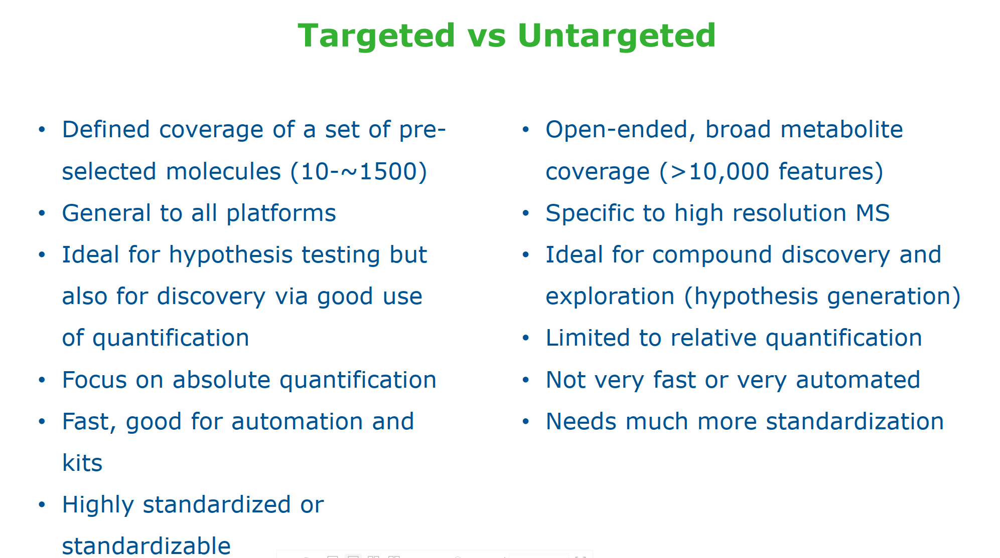

# Molecular_Systems_Biology
## Introduction to Metabolomics
- What is metabolomics? What is its potential and what are the limitations?
    The complete collection of small molecule metabolites in a cell, organ, tissue or organism at a given time.
    It can answer the physiology and phenotype of a tissue or organism, and the pathway is well understood. But with a great difficulty of measurements, and easily be influenced by physiological or environmental factors, its more time sensitive.

- How do you acquire data about small molecule? What type of data for LC-MS workflow? How can we go from spectra to metabolite identification?
    GC/MS, LC/MS, NMR
    We can get feature(unique combination of m/z), retention time(RT), abundance information
    Matching with the database

- What can I use targeted metabolomics for? and untargeted metabolomics? What are limitations and advantages of each approach?
    We can use targeted metabolomics to get the levels of specific metabolites in a sample.
    We can use the untargeted metabolomics to know the global metabolic profile of a sample.
